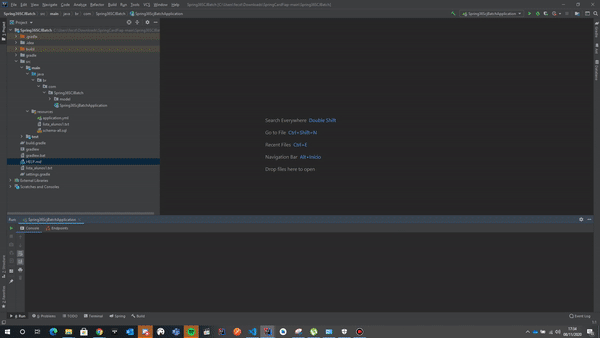
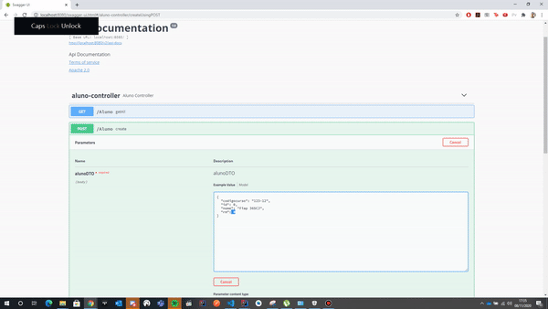
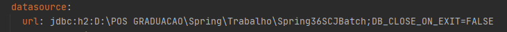

<h1 align="center">Spring Framework</h1>

 

   <a href="#-projeto">Projeto</a>&nbsp;&nbsp;&nbsp;|&nbsp;&nbsp;&nbsp;
   <a href="#tecnologias">Tecnologias</a>&nbsp;&nbsp;&nbsp;|&nbsp;&nbsp;&nbsp;
   <a href="#rotas">Rotas e Endpoints</a>&nbsp;&nbsp;&nbsp;|&nbsp;&nbsp;&nbsp;
   <a href="#swagger">Swagger</a>&nbsp;&nbsp;&nbsp;|&nbsp;&nbsp;&nbsp;
 

   

    
  

 ## 💻 Projeto

 Projeto referente a disciplina de Spring Framework, do MBA da [FIAP](https://www.fiap.com.br/mba/mba-em-full-stack-developer-microservices-cloud-e-iot/). A FIAP resolveu criar seu próprio cartão de crédito para ser utilizado pelos alunos e para isso necessita de um sistema para gerenciamento e integração com outras empresas.

 ## :rocket: Tecnologias

 - Java 8
 - Gradle - Gerenciador de dependências 
 - H2 - Banco de dados da aplicação
 - Spring Boot - Subir a aplicação e carregar os contextos da aplicação
 - Spring Batch - Processamento do arquivo de cadastro dos alunos
 - Spring Data - Manipulação e gerenciamento do banco de dados
 - Flyway - Inicialização da tabela e gerenciamento de versão do banco de dados
 - Swagger - Interface grafica com todos os endpoints mapeados para utilização da aplicação

### Swagger 
A aplicação pode ser testada a partir da interface gráfica do Swagger, basta acessar a url: http://localhost:8080/swagger-ui.html , por ele será possivel realizar todas as transações do projeto

 

    
 

## Instruções basicas

1-Antes de iniciarmos , favor editar o arquivo application.yml no campo URL com um endereço valido para criação do banco de dados H2, indicador abaixo:

 

    
 

 
2-Para iniciar o projeto Card, será necessário executar primeiro o Batch para criação da tabela e preenchimento inicial dos alunos.
3-Exemplo de preenchimento para novo aluno:
        {
          "codigocurso": "123-12",
          "id": 0,
          "nome": "FIAP 36SCJ",
          "rm": 123456
        }
4-Exemplo de preenchimento para uma nova transação:
       {
         "aluno": {
           "codigoCurso": "string",
           "id": 1317,      <--Id gerado na criação do aluno
           "nome": "string",
           "rm": 0
         },
         "autorizadora": "MASTERCARD",
         "id": 0,
         "valor": 1234.56
       }

5- Enjoy

 ---
<h4 align="center">
   Code and coffee ☕
</h4>
